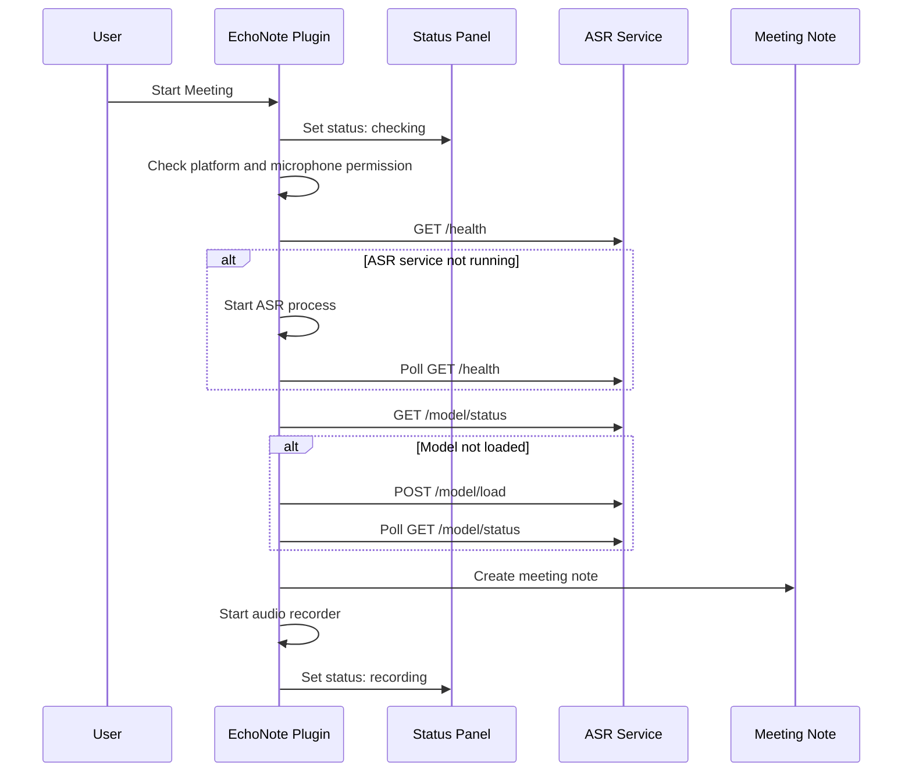
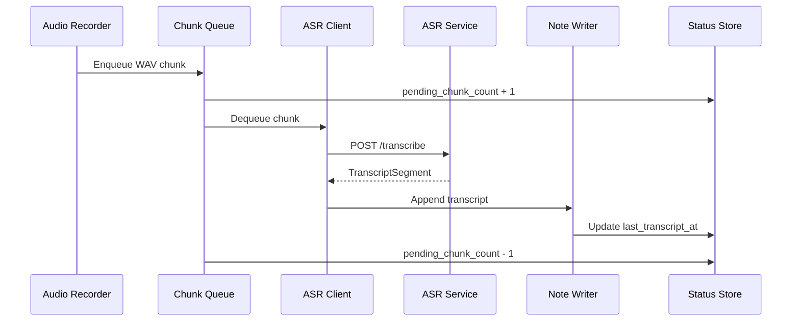
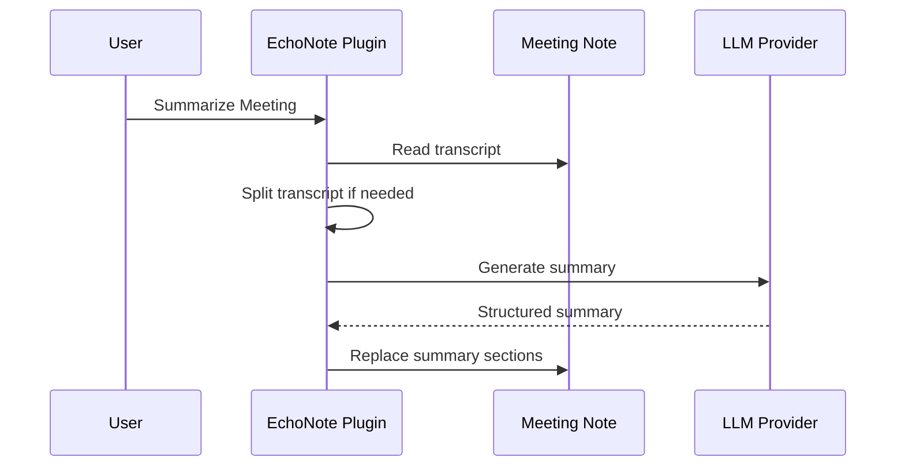

# EchoNote MVP 技术设计文档

## 1. 文档信息

- 产品名称：EchoNote
- 对应 PRD：[docs/PRD.md](./PRD.md)
- 技术方案版本：v0.1
- 目标平台：Obsidian Desktop on macOS
- ASR 方案：本地 Python ASR 服务 + MLX Qwen3 ASR 模型
- 默认模型：`mlx-community/Qwen3-ASR-0.6B-4bit`

## 2. 设计目标

EchoNote MVP 的技术设计目标是用尽可能清晰的模块边界实现以下能力：

- Obsidian 插件内一键启动本地 ASR 服务。
- 在 Obsidian 中完成麦克风录音、音频分段和会议笔记写入。
- 使用本地 MLX ASR 模型完成准实时分段转录。
- 使用 OpenAI-compatible 或 Anthropic API 生成会议总结。
- 用状态面板统一呈现麦克风权限、ASR 服务、模型加载、录音和任务队列状态。
- 保持 ASR Provider 和 LLM Provider 的抽象边界，为后续扩展 `whisper.cpp`、本地 LLM 或其他 Provider 预留空间。

## 3. 非目标

MVP 不解决以下问题：

- 跨平台录音和 ASR 适配。
- 移动端 Obsidian 支持。
- 流式实时 ASR。
- 发言人分离或声纹识别。
- 会议平台音频捕获。
- 直接捕获 macOS 系统输出音频。
- ScreenCaptureKit 或 native helper 音频捕获。
- 团队协作和云同步。
- 自动安装 Python、MLX 和模型依赖的完整安装器。

## 4. 总体架构

EchoNote 采用 Obsidian 插件进程和本地 ASR 服务进程分离的架构。

```text
┌─────────────────────────────────────────────────────────┐
│                    Obsidian Desktop                     │
│                                                         │
│  ┌───────────────────────────────────────────────────┐  │
│  │              EchoNote Plugin                      │  │
│  │                                                   │  │
│  │  UI / Commands / Settings / Status Panel          │  │
│  │  Meeting Session Controller                       │  │
│  │  Audio Recorder + Chunker                         │  │
│  │  ASR Service Client + Process Manager             │  │
│  │  Meeting Note Writer                              │  │
│  │  LLM Summary Service                              │  │
│  └───────────────────────────────────────────────────┘  │
└───────────────────────────┬─────────────────────────────┘
                            │ HTTP localhost
                            │
┌───────────────────────────▼─────────────────────────────┐
│                 Local ASR Service                       │
│                                                         │
│  Python HTTP Server                                     │
│  Model Manager                                          │
│  Audio Preprocessor                                     │
│  MLX Qwen3 ASR Adapter                                  │
│                                                         │
│  mlx-community/Qwen3-ASR-0.6B-4bit                       │
│  mlx-community/Qwen3-ASR-1.7B-4bit                       │
└─────────────────────────────────────────────────────────┘
```

### 4.1 模块职责

Obsidian 插件负责：

- 插件生命周期管理。
- 设置读取和保存。
- Ribbon 图标和命令面板命令注册。
- 状态面板 UI。
- 麦克风权限请求。
- 音频采集、重采样、分段和临时缓存。
- 启动、停止和健康检查本地 ASR 服务。
- 将音频分段发送给 ASR 服务。
- 将转录结果追加写入会议笔记。
- 调用 LLM Provider 生成会议总结。

本地 ASR 服务负责：

- 加载指定 MLX ASR 模型。
- 暴露健康检查和模型状态接口。
- 接收音频分段。
- 对音频进行必要的预处理。
- 调用模型完成转录。
- 返回结构化转录结果。

## 5. 推荐技术栈

### 5.1 Obsidian 插件

- 语言：TypeScript。
- 构建工具：Obsidian 插件常规 Rollup 或 esbuild 方案。
- UI：Obsidian 原生 PluginSettingTab、WorkspaceLeaf、ItemView 和 DOM API。
- 录音：Web Audio API。
- 本地进程管理：Node.js `child_process`。
- HTTP 请求：`fetch`。

### 5.2 本地 ASR 服务

- 语言：Python 3.11+。
- HTTP 服务：FastAPI + Uvicorn。
- ASR Runtime：MLX 相关 Python 依赖。
- 音频处理：优先接收插件侧生成的 16kHz mono WAV，服务侧只做轻量校验和解码。

FastAPI 不是业务强依赖，但它适合快速暴露结构化接口、健康检查和 OpenAPI 文档。若后续希望降低依赖，可以替换为标准库 HTTP Server 或其他轻量框架。

## 6. 项目目录建议

插件代码和 ASR 服务代码必须拆分为两个独立顶层目录：

- `plugin/`：Obsidian 插件工程，包含 TypeScript 源码、插件构建配置和 Obsidian 插件清单。
- `asr-service/`：本地 ASR 服务工程，包含 Python 源码、Python 依赖配置和服务说明。

仓库根目录只保留文档、README、License 和后续可能需要的协作脚本，不直接放插件源码或 ASR 服务源码。

```text
EchoNote/
  README.md
  License
  docs/
    PRD.md
    TECH_DESIGN.md
    DELIVERY_PLAN.md
  plugin/
    manifest.json
    package.json
    tsconfig.json
    esbuild.config.mjs
    README.md
    src/
      main.ts
      settings/
        settings.ts
        settings-tab.ts
      status/
        status-store.ts
        status-view.ts
        status-types.ts
      meeting/
        meeting-session.ts
        meeting-note-writer.ts
        meeting-template.ts
      audio/
        audio-recorder.ts
        audio-chunker.ts
        wav-encoder.ts
        audio-types.ts
      asr/
        asr-process-manager.ts
        asr-service-client.ts
        asr-types.ts
      llm/
        llm-types.ts
        llm-provider.ts
        openai-compatible-provider.ts
        anthropic-provider.ts
        summary-service.ts
      utils/
        platform.ts
        time.ts
        errors.ts
  asr-service/
    pyproject.toml
    README.md
    echonote_asr/
      __init__.py
      app.py
      config.py
      model_manager.py
      transcriber.py
      audio.py
      schemas.py
```

MVP 可以先不一次性创建所有文件，但必须保持 `plugin/` 和 `asr-service/` 两个代码目录独立。两个目录可以各自拥有依赖锁文件、构建命令和测试命令。

## 7. 核心数据流

### 7.1 会议启动流程



### 7.2 音频分段转录流程



### 7.3 总结生成流程



## 8. Obsidian 插件设计

### 8.1 插件入口

`plugin/src/main.ts` 负责：

- 加载设置。
- 注册 Ribbon 图标。
- 注册命令。
- 注册设置页。
- 注册状态面板 View。
- 初始化核心服务实例。
- 在插件卸载时停止录音、释放资源，并根据策略关闭 ASR 服务。

### 8.2 核心服务依赖

建议插件启动时创建以下单例：

```ts
type EchoNoteServices = {
  settings: EchoNoteSettings;
  statusStore: StatusStore;
  asrProcessManager: AsrProcessManager;
  asrServiceClient: AsrServiceClient;
  audioRecorder: AudioRecorder;
  meetingSession: MeetingSessionController;
  noteWriter: MeetingNoteWriter;
  summaryService: SummaryService;
};
```

`MeetingSessionController` 是主要编排者，负责把录音、ASR、笔记写入和状态更新串起来。

### 8.3 设置模型

```ts
type LlmProviderType = "openai-compatible" | "anthropic";

type AsrModelPreset =
  | "mlx-community/Qwen3-ASR-0.6B-4bit"
  | "mlx-community/Qwen3-ASR-1.7B-4bit"
  | "custom";

type EchoNoteSettings = {
  meetingFolder: string;
  meetingTitleFormat: string;
  meetingTemplate: string;
  enableTimestamps: boolean;

  asrModelPreset: AsrModelPreset;
  customAsrModelId: string;
  pythonPath: string;
  asrServicePath: string;
  asrServicePort: number;
  chunkLengthSeconds: 10 | 15 | 30;
  autoStartAsrService: boolean;

  audioInputDeviceId: string;
  audioInputDeviceLabel: string;
  saveRawAudio: boolean;
  audioSaveFolder: string;

  llmProvider: LlmProviderType;
  openaiApiKey: string;
  openaiBaseUrl: string;
  openaiModel: string;
  anthropicApiKey: string;
  anthropicModel: string;
  summaryLanguage: "auto" | "zh" | "en";
  summaryPrompt: string;
};
```

默认值：

```ts
const DEFAULT_SETTINGS: EchoNoteSettings = {
  meetingFolder: "Meetings",
  meetingTitleFormat: "YYYY-MM-DD HH-mm Meeting",
  meetingTemplate: DEFAULT_MEETING_TEMPLATE,
  enableTimestamps: true,

  asrModelPreset: "mlx-community/Qwen3-ASR-0.6B-4bit",
  customAsrModelId: "",
  pythonPath: "python3",
  asrServicePath: "../asr-service",
  asrServicePort: 8765,
  chunkLengthSeconds: 15,
  autoStartAsrService: true,

  audioInputDeviceId: "default",
  audioInputDeviceLabel: "Default audio input",
  saveRawAudio: false,
  audioSaveFolder: "Meetings/audio",

  llmProvider: "openai-compatible",
  openaiApiKey: "",
  openaiBaseUrl: "https://api.openai.com/v1",
  openaiModel: "",
  anthropicApiKey: "",
  anthropicModel: "",
  summaryLanguage: "zh",
  summaryPrompt: DEFAULT_SUMMARY_PROMPT,
};
```

## 9. 状态模型设计

状态面板不应直接从各模块拉取状态，而应订阅统一的 `StatusStore`。

### 9.1 状态类型

```ts
type MicrophonePermissionStatus = "unknown" | "granted" | "denied";
type AsrServiceStatus = "not_started" | "starting" | "running" | "error";
type ModelStatus = "not_loaded" | "loading" | "ready" | "error";
type RecordingStatus = "idle" | "recording" | "paused" | "stopping" | "error";

type EchoNoteStatus = {
  microphonePermission: MicrophonePermissionStatus;
  asrService: AsrServiceStatus;
  model: ModelStatus;
  selectedModel: string;
  recording: RecordingStatus;
  currentMeetingPath: string | null;
  currentMeetingTitle: string | null;
  pendingChunkCount: number;
  lastTranscriptAt: number | null;
  lastError: EchoNoteError | null;
};
```

### 9.2 状态更新原则

- 所有可见状态都通过 `StatusStore` 更新。
- 业务模块只写状态，不直接操作状态面板 DOM。
- 状态面板只订阅状态并渲染。
- 错误状态应保留可读错误消息和技术错误码。

### 9.3 关键状态转换

```text
ASR Service:
not_started -> starting -> running
not_started -> starting -> error
running -> error
running -> not_started

Model:
not_loaded -> loading -> ready
not_loaded -> loading -> error
ready -> loading
ready -> error

Recording:
idle -> recording
recording -> paused
paused -> recording
recording -> stopping -> idle
paused -> stopping -> idle
recording -> error
```

## 10. 本地 ASR 服务设计

### 10.1 服务启动方式

插件使用 Node.js `child_process.spawn` 启动 Python 服务。

概念命令：

```text
python3 -m echonote_asr.app --port 8765 --model mlx-community/Qwen3-ASR-0.6B-4bit
```

启动参数：

- `--host`：默认 `127.0.0.1`。
- `--port`：默认 `8765`。
- `--model`：当前选择的模型 ID。
- `--log-level`：默认 `info`。

插件启动服务后需要轮询 `GET /health`，直到服务 ready 或超时。

### 10.2 进程管理策略

`AsrProcessManager` 负责：

- 检查端口上的服务是否可用。
- 启动 ASR 服务。
- 保存子进程引用。
- 监听 stdout、stderr 和 exit 事件。
- 在服务异常退出时更新状态。
- 用户点击重启时停止旧服务并启动新服务。

MVP 中只管理由 EchoNote 启动的进程。若端口上已有兼容服务，可以直接连接，但需要在状态面板显示“已连接到现有服务”。

### 10.3 服务 API

MVP API 使用 HTTP JSON + multipart/form-data。

#### `GET /health`

响应：

```json
{
  "status": "ok",
  "service": "echonote-asr",
  "version": "0.1.0"
}
```

#### `GET /model/status`

响应：

```json
{
  "model_id": "mlx-community/Qwen3-ASR-0.6B-4bit",
  "status": "ready",
  "error": null
}
```

`status` 取值：

```text
not_loaded
loading
ready
error
```

#### `POST /model/load`

请求：

```json
{
  "model_id": "mlx-community/Qwen3-ASR-0.6B-4bit"
}
```

响应：

```json
{
  "model_id": "mlx-community/Qwen3-ASR-0.6B-4bit",
  "status": "loading"
}
```

说明：PRD 中只要求 `/model/status`，但技术设计建议增加显式 `/model/load`，避免模型加载只能隐式发生在服务启动或首次转录时。

#### `POST /transcribe`

请求：`multipart/form-data`

- `audio`：WAV 文件，16kHz，mono，PCM 16-bit。
- `chunk_id`：字符串。
- `started_at_ms`：音频分段对应会议起始偏移，毫秒。
- `ended_at_ms`：音频分段对应会议结束偏移，毫秒。
- `language`：可选，MVP 可默认 `auto`。

响应：

```json
{
  "chunk_id": "chunk_000012",
  "text": "我们今天主要讨论 EchoNote 第一版的范围。",
  "started_at_ms": 180000,
  "ended_at_ms": 195000,
  "language": "zh",
  "model_id": "mlx-community/Qwen3-ASR-0.6B-4bit"
}
```

#### `POST /shutdown`

响应：

```json
{
  "status": "shutting_down"
}
```

### 10.4 Python 服务内部模块

```text
echonote_asr/
  app.py            FastAPI 应用和路由
  config.py         CLI 参数和运行配置
  schemas.py        请求/响应模型
  model_manager.py  模型加载、缓存、状态管理
  transcriber.py    ASR Adapter
  audio.py          WAV 校验和音频读取
```

### 10.5 模型加载策略

MVP 推荐服务启动后异步加载模型：

1. 服务进程启动。
2. `/health` 先返回服务可用。
3. 后台开始加载模型。
4. `/model/status` 返回 `loading`。
5. 模型加载完成后返回 `ready`。

这样状态面板可以更早展示服务状态，同时明确模型仍在加载。

### 10.6 ASR Adapter 边界

由于具体模型推理 API 可能随 MLX 生态变化，服务内部需要把模型调用限制在 `transcriber.py`：

```python
class Transcriber:
    def load(self, model_id: str) -> None:
        ...

    def transcribe_wav(self, wav_path: str) -> str:
        ...
```

后续如果模型加载方式或推理接口变化，只需要替换 Adapter，不影响 HTTP API 和插件侧逻辑。

## 11. 音频录制与分段设计

### 11.1 推荐方案

插件侧使用 Web Audio API 获取所选输入设备的 PCM 数据，并在插件侧完成：

- 单声道混音。
- 重采样到 16kHz。
- 按配置的 10、15 或 30 秒切片。
- 编码为 PCM 16-bit WAV。

这样可以避免使用 `MediaRecorder` 产生 `webm/opus` 等格式后再依赖服务侧转码，也能减少对 `ffmpeg` 的依赖。

MVP 使用虚拟音频输入设备支持会议软件输出录制。EchoNote 不直接捕获系统输出音频；用户需要通过 BlackHole、Loopback 等工具将麦克风和会议软件输出混合为一个输入设备，然后在 EchoNote 设置中选择该输入设备。

录音约束建议：

```ts
navigator.mediaDevices.getUserMedia({
  audio: {
    deviceId: selectedDeviceId === "default" ? undefined : { exact: selectedDeviceId },
    echoCancellation: false,
    noiseSuppression: false,
    autoGainControl: false
  }
});
```

关闭回声消除、降噪和自动增益是为了避免虚拟混音输入被浏览器音频处理破坏。

### 11.2 AudioRecorder 职责

`AudioRecorder` 负责：

- 请求麦克风权限。
- 枚举音频输入设备。
- 使用用户选择的音频输入设备。
- 创建 `AudioContext`。
- 连接 `MediaStreamAudioSourceNode`。
- 采集 PCM float samples。
- 支持开始、暂停、继续、停止。
- 将 PCM 数据交给 `AudioChunker`。

### 11.3 AudioChunker 职责

`AudioChunker` 负责：

- 聚合 PCM samples。
- 按 `chunkLengthSeconds` 生成音频分段。
- 生成 chunk metadata。
- 调用 `WavEncoder` 输出 WAV bytes。
- 将 chunk 放入转录队列。

### 11.4 音频分段数据结构

```ts
type AudioChunk = {
  id: string;
  startedAtMs: number;
  endedAtMs: number;
  wavBytes: ArrayBuffer;
  createdAt: number;
  durationMs: number;
  rms: number;
};
```

### 11.5 转录队列

转录队列需要保证：

- 分段按顺序处理。
- 单个分段失败不阻塞后续分段。
- 小于 1 秒的尾段不送 ASR。
- RMS 低于静音阈值的分段不送 ASR。
- 被过滤的分段仍可用于完整会议 WAV 保存。
- 队列长度变化实时更新状态面板。
- 停止会议时可以尝试 flush 当前缓冲区。

MVP 可以采用单并发转录，避免本地模型并发推理造成资源竞争。

```ts
type TranscriptionQueueOptions = {
  concurrency: 1;
  continueOnError: true;
};
```

## 12. 会议笔记写入设计

### 12.1 MeetingNoteWriter 职责

`MeetingNoteWriter` 负责：

- 创建会议目录。
- 根据模板创建会议笔记。
- 追加 transcript。
- 更新会议结束时间。
- 替换总结相关章节。
- 防止覆盖 `## Transcript`。

### 12.2 创建会议笔记

创建流程：

1. 生成会议标题。
2. 计算目标路径。
3. 若路径已存在，追加递增后缀。
4. 渲染会议模板。
5. 使用 Obsidian Vault API 创建文件。
6. 保存当前会议路径到 `StatusStore`。

### 12.3 Transcript 追加策略

MVP 使用基于章节定位的文本追加：

1. 读取当前会议笔记内容。
2. 定位 `## Transcript`。
3. 将新转录段落追加到文件末尾。

由于模板中 `## Transcript` 位于最后，MVP 可以直接 append 到文件末尾。后续如果允许用户自定义模板并将 Transcript 放在中间，需要改为更严格的 section parser。

### 12.4 Summary 替换策略

总结生成后只替换以下 section：

- `## Summary`
- `## Decisions`
- `## Action Items`
- `## Key Points`
- `## Open Questions`

替换原则：

- 如果 section 存在，只替换该 section 内容。
- 如果 section 不存在，在 `## Transcript` 前插入。
- 不修改 `## Transcript` 及其内容。

MVP 可实现简单 Markdown section parser：

```ts
type MarkdownSection = {
  heading: string;
  startIndex: number;
  contentStartIndex: number;
  endIndex: number;
};
```

## 13. LLM 总结设计

### 13.1 Provider 接口

```ts
type SummaryRequest = {
  transcript: string;
  language: "auto" | "zh" | "en";
  prompt: string;
};

type MeetingSummary = {
  meetingTitle: string;
  summary: string;
  decisions: string[];
  actionItems: string[];
  keyPoints: string[];
  openQuestions: string[];
};

interface LlmProvider {
  id: string;
  generateSummary(request: SummaryRequest): Promise<MeetingSummary>;
}
```

### 13.2 OpenAI-compatible Provider

请求使用 Chat Completions 兼容接口：

```text
POST {baseUrl}/chat/completions
Authorization: Bearer {apiKey}
```

MVP 使用 JSON 输出约束提示词，要求模型返回可解析 JSON。若解析失败，保留原始文本并提示用户重试。

### 13.3 Anthropic Provider

请求使用 Anthropic Messages API：

```text
POST https://api.anthropic.com/v1/messages
x-api-key: {apiKey}
anthropic-version: 2023-06-01
```

为了支持后续代理或自定义网关，Anthropic Base URL 可暂不暴露为 MVP 设置，但内部实现可保留常量或扩展点。

### 13.4 长文本总结

`SummaryService` 负责处理长 transcript：

```text
Transcript
  -> split into transcript chunks
  -> summarize each chunk
  -> merge partial summaries
  -> write final summary
```

MVP 可以先使用字符数近似切分，后续再引入 token estimator。

建议默认阈值：

- 单段最大输入字符数：20,000。
- 超过阈值后启用分段总结。

## 14. 错误处理设计

### 14.1 错误类型

```ts
type EchoNoteErrorCode =
  | "UNSUPPORTED_PLATFORM"
  | "MIC_PERMISSION_DENIED"
  | "ASR_SERVICE_START_FAILED"
  | "ASR_SERVICE_UNAVAILABLE"
  | "ASR_MODEL_LOAD_FAILED"
  | "ASR_TRANSCRIBE_FAILED"
  | "NOTE_CREATE_FAILED"
  | "NOTE_WRITE_FAILED"
  | "LLM_CONFIG_MISSING"
  | "LLM_REQUEST_FAILED"
  | "LLM_RESPONSE_PARSE_FAILED";

type EchoNoteError = {
  code: EchoNoteErrorCode;
  message: string;
  detail?: string;
  recoverable: boolean;
  createdAt: number;
};
```

### 14.2 错误展示原则

- 用户可恢复错误显示在状态面板，并提供操作按钮。
- 技术细节可折叠展示，避免干扰主流程。
- 所有 ASR 分段错误应记录 chunk ID。
- 失败分段不删除已写入内容。

### 14.3 关键错误恢复

| 错误 | 恢复方式 |
| --- | --- |
| 麦克风权限被拒绝 | 引导用户到系统设置开启权限 |
| ASR 服务启动失败 | 展示 Python 路径、端口和 stderr 摘要 |
| 模型加载失败 | 展示模型 ID、错误信息，允许重试 |
| 单段转录失败 | 标记 chunk 失败，继续处理后续 chunk |
| LLM 配置缺失 | 引导用户打开设置页填写 API Key 和模型 |

## 15. 隐私与数据边界

### 15.1 本地数据

本地保存：

- 会议 Markdown 笔记。
- 插件设置。
- 可选原始音频。
- ASR 服务本地模型缓存。

默认不保存：

- 原始会议音频。
- 临时音频 chunk。

### 15.2 网络请求

默认 ASR 不发起云端请求，但模型首次下载可能由 MLX/Hugging Face 相关依赖触发网络下载。MVP 文档和设置页需要明确提示。

LLM 总结会向用户配置的 Provider 发送 transcript：

- OpenAI-compatible。
- Anthropic。
- 用户自定义本地 OpenAI-compatible Endpoint。

### 15.3 API Key 存储

MVP 使用 Obsidian 插件设置存储 API Key。设置页需要提示用户：API Key 存储在本地 Obsidian 插件配置中。

后续版本可以考虑系统 Keychain。

## 16. 日志设计

MVP 日志分两类：

- 插件日志：记录到开发者控制台，可在状态面板显示最近错误摘要。
- ASR 服务日志：stdout/stderr 由 `AsrProcessManager` 捕获，并保存最近 N 行到内存中。

建议内存保留：

```text
last 200 log lines
```

状态面板错误详情可以展示最近 ASR stderr 摘要。

## 17. 安全设计

- ASR 服务只监听 `127.0.0.1`。
- 不监听公网地址。
- `/shutdown` 仅用于本地插件控制。
- MVP 可不引入鉴权，但应限制 host 为 localhost。
- 后续如果支持远程 ASR 服务，需要加入 token 或其他认证机制。

## 18. 实现里程碑

### Milestone 1：插件骨架

交付内容：

- Obsidian 插件基础工程。
- `manifest.json`、构建配置和基础 README。
- 设置页。
- Ribbon 图标。
- 命令注册。
- 状态面板空壳。

验收：

- 插件可以在 Obsidian 中加载。
- 可以打开设置页和状态面板。

### Milestone 2：本地 ASR 服务骨架

交付内容：

- Python ASR 服务目录 `asr-service/`。
- FastAPI 服务。
- `/health`、`/model/status`、`/model/load`、`/transcribe`、`/shutdown`。
- 模型管理状态机。
- 假转录实现，用于插件端联调。

验收：

- 插件可以启动服务。
- 状态面板可以展示服务和模型状态。
- 假转录可以返回文本。

### Milestone 3：真实 ASR Spike

交付内容：

- 跑通 `mlx-community/Qwen3-ASR-0.6B-4bit` 单段音频转录。
- 确认模型加载方式、输入格式、输出格式和性能。
- 将真实转录封装到 `Transcriber`。

验收：

- 命令行或 HTTP API 可以转录一个本地 WAV 文件。
- 记录模型首次加载时间和单段转录耗时。

### Milestone 4：录音、分段和笔记写入

交付内容：

- 麦克风权限请求。
- Web Audio API 录音。
- 16kHz mono WAV 编码。
- 分段队列。
- 自动新建会议笔记。
- Transcript 追加写入。

验收：

- 开始会议后可以持续把转录文本追加到新建笔记。
- 停止会议后已写入内容不丢失。

### Milestone 5：LLM 总结

交付内容：

- OpenAI-compatible Provider。
- Anthropic Provider。
- SummaryService。
- Summary section 替换。
- 长 transcript 分段总结。

验收：

- 可以用两类 Provider 生成总结。
- 总结不会覆盖 Transcript。

### Milestone 6：稳定性和打包

交付内容：

- 错误处理完善。
- 状态面板错误详情。
- ASR 服务重启。
- 原始音频保存开关。
- 使用文档。
- MVP 验收测试。

验收：

- 满足 PRD 中的 MVP 验收标准。

## 19. 关键技术风险

### 19.1 MLX Qwen3 ASR 模型调用方式不确定

风险：模型的加载和推理 API 可能不是标准接口。

缓解：

- 优先做真实 ASR Spike。
- 将模型调用封装在 `Transcriber` Adapter。
- HTTP API 和插件侧逻辑不依赖具体模型库细节。

### 19.2 本地模型性能不足

风险：0.6B 模型在普通 Mac 上仍可能加载慢或转录延迟高。

缓解：

- 默认 15 秒分段。
- 单并发转录，避免资源争抢。
- 状态面板显示 pending chunk。
- 后续允许用户选择更短或更长分段。

### 19.3 Obsidian 麦克风权限和 Web Audio 差异

风险：Obsidian Electron 环境中的麦克风权限行为可能与浏览器不同。

缓解：

- 早期实现麦克风权限 Spike。
- 状态面板明确展示权限状态。
- 提供 macOS 系统设置引导。

### 19.4 Markdown section 替换误伤内容

风险：用户自定义模板后，总结替换可能误伤 Transcript。

缓解：

- MVP 默认模板中 Transcript 位于最后。
- Summary 替换仅操作白名单章节。
- 替换前保留原始内容快照在内存中，失败则不写入。

### 19.5 Python 环境不可用

风险：用户本地没有合适 Python 或依赖未安装。

缓解：

- 设置中暴露 Python 路径。
- ASR 服务启动失败时展示 stderr。
- v0.2 增加依赖检查和安装引导。

## 20. MVP 测试计划

### 20.1 单元测试

优先覆盖：

- 设置默认值合并。
- Markdown section parser。
- Meeting template rendering。
- WAV encoder。
- LLM response parser。
- StatusStore 状态更新。

### 20.2 集成测试

优先覆盖：

- 插件启动 ASR 服务。
- `/health` 和 `/model/status` 状态读取。
- 假转录结果写入会议笔记。
- Summary section 替换不影响 Transcript。

### 20.3 手动验收测试

测试场景：

- 第一次启动插件。
- 麦克风权限未授权。
- ASR 服务端口被占用。
- 模型加载成功。
- 模型加载失败。
- 开始、暂停、继续、停止会议。
- 默认不保存音频。
- 开启保存音频。
- OpenAI-compatible 总结。
- Anthropic 总结。
- 长 transcript 分段总结。

## 21. 待确认技术问题

以下问题不阻塞技术设计，但需要在开发 Spike 中确认：

- `mlx-community/Qwen3-ASR-0.6B-4bit` 的推荐 Python 推理入口。
- 模型是否要求特定音频采样率、声道数或输入格式。
- 0.6B 和 1.7B 在目标 Mac 上的加载时间、内存占用和单段转录耗时。
- Obsidian 当前 Electron 版本下 Web Audio API 采集和 AudioWorklet 支持情况。
- 是否需要为 ASR 服务提供独立虚拟环境创建脚本。

## 22. v0.8.0 性能架构

- Summary planner 在 turn、段落和句子边界切块，最多并发两个 partial 请求，并按输入顺序合并结果。
- Meeting audio spool 在 32 MiB PCM 以内保留原始 chunk buffer，超过后串行写入权限为 `0600` 的临时 PCM 文件。
- 停止会议时只组装一次完整 WAV，并复用于 Vault 保存和 speaker finalization。
- 实时转录写入最多合并 250 ms，停止流程等待 ASR 队列和写入缓冲同时排空。
- ASR 服务以独立 inference lock 串行模型加载与推理，复用单一工作目录，并在请求结束后删除输入文件。
- Speaker assignment 对 turns 和 intervals 各排序一次，通过时间窗口只计算可能重叠的候选项，再按原始 turn 顺序生成标签。
- 时间基准保留在发布报告中；CI 使用内容等价、并发上限、清理行为和 overlap-check 次数作为稳定门禁。
