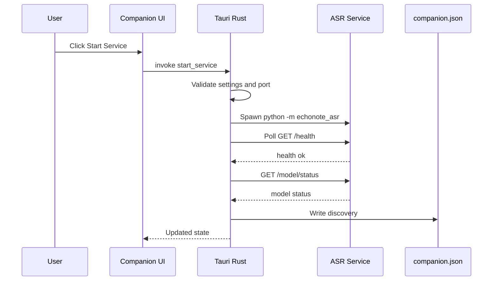
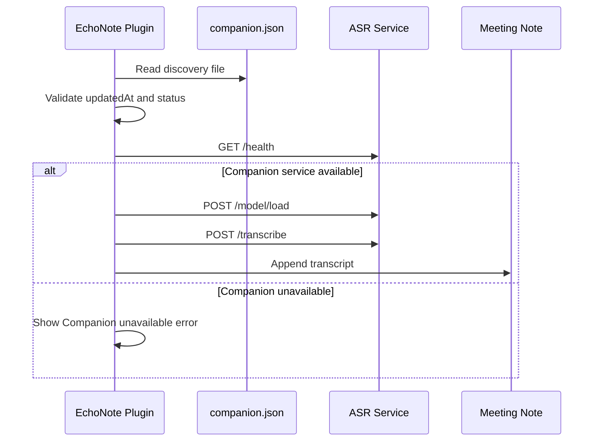
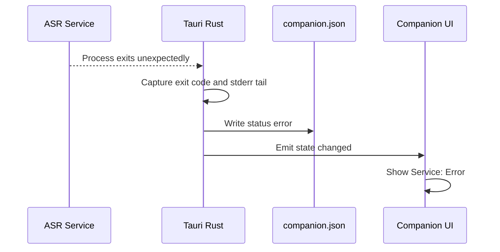

# EchoNote v0.2.0 技术设计文档：Tauri ASR Companion

## 1. 文档信息

- 产品名称：EchoNote
- 对应 PRD：[docs/V0_2_0_TAURI_COMPANION_PRD.md](./V0_2_0_TAURI_COMPANION_PRD.md)
- 技术方案版本：v0.2.0
- 目标平台：macOS
- 主要客户端：Obsidian Desktop 插件
- Companion 技术栈：Tauri + TypeScript Web UI + Rust process manager
- ASR 方案：继续复用现有 Python FastAPI ASR service
- 文档状态：技术设计草案

## 2. 设计目标

v0.2.0 的技术目标是将 ASR runtime 管理从 Obsidian 插件中抽离到一个独立 macOS Companion 应用中，同时保持 v0.1.0 的核心能力和 API 兼容性。

具体目标：

- 新增 `companion/` Tauri 应用工程。
- Companion 负责启动、停止、重启、监控现有 Python ASR service。
- Companion 负责保存配置、写入 discovery 文件、捕获日志和生成诊断报告。
- Obsidian 插件通过 discovery 文件发现 Companion 管理的 ASR endpoint。
- Obsidian 插件固定使用 Companion runtime，不再保留插件侧 Python ASR fallback。
- ASR service HTTP API 保持兼容，不为 v0.2.0 引入新的强制 Companion HTTP API。

## 3. 非目标

本设计不解决：

- 打包完整 Python runtime。
- 将 MLX 模型权重内置到 Companion。
- 模型自动下载和模型仓库管理。
- macOS 签名、公证、Sparkle 自动更新。
- Windows、Linux 或 Obsidian Mobile 支持。
- 重写 ASR 推理 runtime。
- token 级流式 ASR。
- 发言人分离。
- 直接捕获系统音频。
- 恢复 v0.1.0 的插件手动 ASR service 管理能力。

## 4. 总体架构

v0.2.0 后，EchoNote 由三个本地进程协作：

```text
┌──────────────────────────────────────────────────────────────┐
│                      Obsidian Desktop                        │
│                                                              │
│  EchoNote Plugin                                             │
│  - Audio Recorder + Chunker                                  │
│  - Meeting Session Controller                                │
│  - ASR Runtime Resolver                                      │
│  - ASR Service Client                                        │
│  - Meeting Note Writer                                       │
│  - LLM Summary Service                                       │
└───────────────────────────────┬──────────────────────────────┘
                                │
                                │ read companion.json
                                │ HTTP localhost
                                │
┌───────────────────────────────▼──────────────────────────────┐
│                  EchoNote ASR Companion.app                  │
│                                                              │
│  Tauri Web UI                                                │
│  - Status dashboard                                          │
│  - Settings form                                             │
│  - Logs panel                                                │
│  - Diagnostic report action                                  │
│                                                              │
│  Tauri Rust Backend                                          │
│  - Settings store                                            │
│  - Process manager                                           │
│  - Health/model polling                                      │
│  - Discovery writer                                          │
│  - Log capture                                               │
└───────────────────────────────┬──────────────────────────────┘
                                │ child process
                                │
┌───────────────────────────────▼──────────────────────────────┐
│                    Python ASR Service                        │
│                                                              │
│  FastAPI + Uvicorn                                           │
│  - GET /health                                               │
│  - GET /model/status                                         │
│  - POST /model/load                                          │
│  - POST /transcribe                                          │
│  - POST /shutdown                                            │
│                                                              │
│  MLX Qwen3 ASR backend                                       │
└──────────────────────────────────────────────────────────────┘
```

关键设计原则：

- Companion 管进程，不管会议笔记。
- 插件管录音和 Obsidian 工作流，不管 Companion UI。
- ASR service 继续只暴露 localhost HTTP API。
- discovery 文件是插件和 Companion 的最小耦合点。

## 5. 推荐技术栈

### 5.1 Companion

- 桌面框架：Tauri 2.x。
- 后端：Rust。
- 前端：TypeScript + Vite。
- UI：优先使用轻量原生 HTML/CSS 或后续引入 React；v0.2.0 不强依赖组件库。
- 进程管理：Rust `std::process::Command` + `Child`。
- HTTP 轮询：Rust HTTP client，建议 `reqwest`。
- 日志：Rust 文件写入，按大小或启动周期滚动。
- 配置路径：Tauri `app_handle.path().app_data_dir()`。
- 日志路径：Tauri `app_handle.path().app_log_dir()` 或 macOS `~/Library/Logs/EchoNote`。

### 5.2 Obsidian 插件

- 保持 TypeScript + esbuild。
- 新增 ASR runtime resolver。
- 新增 Companion discovery reader。
- 状态面板增加 Companion 状态展示。

### 5.3 ASR Service

- 保持 Python 3.11+。
- 保持 FastAPI + Uvicorn。
- 保持现有 `fake` 和 `mlx-audio` backend。
- 保持现有 HTTP API。

## 6. 项目结构

建议新增目录：

```text
EchoNote/
  companion/
    package.json
    tsconfig.json
    vite.config.ts
    src/
      main.ts
      styles.css
      components/
        StatusDashboard.ts
        SettingsPanel.ts
        LogsPanel.ts
      lib/
        companion-api.ts
        state.ts
        formatting.ts
    src-tauri/
      Cargo.toml
      tauri.conf.json
      src/
        main.rs
        commands.rs
        config.rs
        diagnostics.rs
        discovery.rs
        health.rs
        logs.rs
        process.rs
        state.rs
        redact.rs
  plugin/
    src/
      asr/
        asr-runtime-resolver.ts
        companion-discovery.ts
        companion-types.ts
```

说明：

- `companion/src/` 只放 Web UI。
- `companion/src-tauri/src/` 放所有本地能力。
- 插件侧新增 runtime resolver，不把 Companion 逻辑塞进现有 `AsrServiceClient`。
- ASR service 目录不因 Companion 引入而搬迁。

## 7. Companion 模块设计

### 7.1 Settings Store

Settings 负责读写：

```text
~/Library/Application Support/EchoNote/companion-settings.json
```

TypeScript/Rust 共享结构建议：

```ts
type CompanionSettings = {
  pythonPath: string;
  asrServicePath: string;
  preferredPort: number;
  backend: "fake" | "mlx-audio";
  modelPreset: "qwen3-0.6b-4bit" | "qwen3-1.7b-4bit" | "custom";
  customModelId: string;
  autoStartService: boolean;
};
```

`autoStartService` is retained as an internal persisted field for forward compatibility, but v0.2.0 does not expose the control in the UI and does not auto-start ASR on Companion launch.

默认值：

```json
{
  "pythonPath": "python3",
  "asrServicePath": "../asr-service",
  "preferredPort": 8765,
  "backend": "fake",
  "modelPreset": "qwen3-0.6b-4bit",
  "customModelId": "",
  "autoStartService": false
}
```

实现要求：

- 启动时如果配置文件不存在，写入默认配置。
- 所有路径在 UI 中展示原始值，同时在 Rust 侧解析为绝对路径。
- 保存配置不自动重启服务，除非用户显式点击 `Restart Service`。

### 7.2 Process Manager

Process Manager 负责 ASR service 子进程生命周期。

启动命令：

```text
<pythonPath> -m echonote_asr
  --host 127.0.0.1
  --port <preferredPort>
  --model <resolvedModelId>
  --backend <backend>
  --log-level info
```

工作目录：

```text
<asrServicePath>
```

状态机：

```text
Stopped -> Starting -> Running
Stopped -> Starting -> Error
Running -> Stopping -> Stopped
Running -> Error
Error -> Starting
```

状态定义：

```ts
type ServiceStatus =
  | "stopped"
  | "starting"
  | "running"
  | "stopping"
  | "error";
```

实现要求：

- 同一时间只能存在一个 Companion 管理的 ASR 子进程。
- `Start Service` 在 `running` 或 `starting` 状态下应 no-op，并返回当前状态。
- `Stop Service` 优先调用 `/shutdown`，超时后再终止子进程。
- 子进程异常退出时，记录 exit code、stderr 摘要并写 discovery。
- Companion 退出时应尝试停止由自己启动的 ASR 子进程。

### 7.3 Health Poller

Health Poller 负责轮询：

- `GET /health`
- `GET /model/status`

轮询策略：

- `starting` 状态：每 500ms 轮询 `/health`，最多 15 秒。
- `running` 状态：每 2 秒轮询 `/health` 和 `/model/status`。
- 连续 3 次 health 失败后将状态置为 `error`，但不立即杀进程。

Model 状态：

```ts
type ModelStatus =
  | "not_loaded"
  | "loading"
  | "ready"
  | "error"
  | "unknown";
```

### 7.4 Discovery Writer

Discovery Writer 写入：

```text
~/Library/Application Support/EchoNote/companion.json
```

冻结的 v1 contract 定义在 [API contract](./API_CONTRACT.md#5-companion-discovery-契约)，机器可读 schema 定义在 [docs/contracts/companion-discovery.schema.json](./contracts/companion-discovery.schema.json)。Rust writer 和插件 reader 都必须以该 contract 为准。TypeScript 镜像类型如下：

```ts
type CompanionDiscovery = {
  version: 1;
  app: "EchoNote ASR Companion";
  service: "echonote-asr";
  status: ServiceStatus;
  baseUrl: string;
  host: "127.0.0.1";
  port: number;
  backend: "fake" | "mlx-audio";
  modelId: string;
  modelStatus: ModelStatus;
  pid: number | null;
  updatedAt: string;
};
```

写入策略：

- 服务状态变化时立即写入。
- model 状态变化时立即写入。
- `running` 状态下至少每 10 秒刷新一次 `updatedAt`。
- 写入使用原子替换：先写临时文件，再 rename 到正式路径。

安全要求：

- discovery 文件不得包含 API key。
- discovery 只描述本机 localhost 服务。

### 7.5 Log Capture

日志文件：

```text
~/Library/Logs/EchoNote/companion.log
~/Library/Logs/EchoNote/asr-service.log
```

日志来源：

- Companion 自身事件。
- ASR service stdout。
- ASR service stderr。
- health/model polling 错误。
- 子进程退出事件。

日志格式建议采用 JSON lines：

```json
{"timestamp":"2026-05-21T10:00:00.000Z","level":"info","event":"service_started","pid":12345}
```

MVP 日志滚动策略：

- 单文件超过 5MB 时 rotate。
- 保留最近 3 个历史文件。

### 7.6 Diagnostics

诊断报告由 Rust 侧生成，再返回给 Web UI 复制到剪贴板。

结构：

```markdown
# EchoNote Diagnostic Report

- Companion version:
- macOS:
- CPU:
- Service status:
- Model status:
- Backend:
- Model ID:
- Base URL:
- Python path:
- ASR service path:
- Last exit code:

## Recent Logs

...
```

脱敏规则：

- 删除形如 `sk-...` 的 API key。
- 删除 `Authorization: Bearer ...`。
- 删除 `.env` 中的密钥值。
- 日志行过长时截断到 2,000 字符。

## 8. Companion Tauri Command 设计

Web UI 通过 Tauri `invoke` 调用 Rust commands。

建议 commands：

```ts
type CompanionCommand =
  | "get_app_state"
  | "get_settings"
  | "save_settings"
  | "start_service"
  | "stop_service"
  | "restart_service"
  | "load_model"
  | "open_logs_folder"
  | "copy_diagnostic_report";
```

核心返回类型：

```ts
type CompanionAppState = {
  serviceStatus: ServiceStatus;
  modelStatus: ModelStatus;
  baseUrl: string | null;
  pid: number | null;
  resolvedModelId: string;
  lastError: string | null;
  lastExitCode: number | null;
  recentLogs: string[];
  discoveryPath: string;
  settingsPath: string;
  logsPath: string;
};
```

错误处理：

- command 不直接 panic。
- 所有错误返回结构化 `{ code, message, detail }`。
- UI 用 `message` 显示用户可读错误，用 `detail` 写日志。

## 9. Companion UI 设计

v0.2.0 先做工具型界面，不做复杂视觉系统。

布局：

```text
┌──────────────────────────────────────────┐
│ EchoNote ASR Companion                   │
├──────────────────────────────────────────┤
│ Service: Running       Model: Ready      │
│ API: http://127.0.0.1:8765               │
│ Model: mlx-community/Qwen3-ASR-0.6B-4bit │
├──────────────────────────────────────────┤
│ [Start] [Stop] [Restart] [Load Model]    │
│ [Copy Diagnostic] [Open Logs Folder]     │
├──────────────────────────────────────────┤
│ Settings                                 │
│ Python Path                              │
│ ASR Service Path                         │
│ Port / Backend / Model                   │
├──────────────────────────────────────────┤
│ Recent Logs                              │
└──────────────────────────────────────────┘
```

UI 原则：

- 首屏直接展示当前可操作状态。
- 错误显示要包含下一步动作，例如检查 Python path 或打开日志。
- 设置项更改后标记为 dirty，需要用户保存。
- 服务运行中修改关键配置时提示需要 restart。

## 10. 插件侧技术设计

### 10.1 新增设置

`EchoNoteSettings` 使用 Companion-only ASR runtime：

```ts
type AsrRuntimeMode = "companion";

type EchoNoteSettings = {
  asrRuntimeMode: AsrRuntimeMode;
  companionDiscoveryPath: string;
  companionDiscoveryMaxAgeSeconds: number;
};
```

默认值：

```ts
{
  asrRuntimeMode: "companion",
  companionDiscoveryPath: "~/Library/Application Support/EchoNote/companion.json",
  companionDiscoveryMaxAgeSeconds: 30
}
```

设置持久化值固定使用小写 `companion`。历史 `auto` 或 `manual` 配置在插件加载时迁移为 `companion`。

### 10.2 Companion Discovery Reader

新增模块：

```text
plugin/src/asr/companion-discovery.ts
```

职责：

- 解析 `~` 为用户 home。
- 读取 `companion.json`。
- 按 [Companion Discovery 契约](./API_CONTRACT.md#5-companion-discovery-契约) 校验 JSON schema、localhost endpoint、`baseUrl`/`host`/`port` 一致性。
- 判断 `updatedAt` 是否 stale；默认最大年龄为 30 秒。
- 只在 schema 有效、`status` 为 `running` 且 discovery 未 stale 时调用 `/health` 二次确认。

返回：

```ts
type CompanionResolution =
  | { kind: "available"; baseUrl: string; discovery: CompanionDiscovery }
  | { kind: "missing"; reason: string }
  | { kind: "invalid"; reason: string }
  | { kind: "not_running"; reason: string; status: ServiceStatus }
  | { kind: "stale"; reason: string }
  | { kind: "unavailable"; reason: string };
```

`updatedAt` 超过最大年龄时直接返回 `stale`，不因为旧 `baseUrl` 的 `/health` 成功而继续使用。

### 10.3 ASR Runtime Resolver

新增模块：

```text
plugin/src/asr/asr-runtime-resolver.ts
```

职责：

- 解析 Companion discovery 决定 ASR endpoint。
- Companion 不可用即返回用户可见错误。
- 不提供插件侧 Python ASR fallback。

返回：

```ts
type AsrRuntime =
  {
    mode: "companion";
    requestedMode: "companion";
    baseUrl: string;
    companion: CompanionResolution & { kind: "available" };
  };
```

`missing`、`invalid`、`not_running`、`stale` 或 `unavailable` 均返回用户可见错误，并把 Companion resolution 写入状态面板。

### 10.4 Meeting Session 集成

当前 `MeetingSessionController` 通过 Companion discovery 创建 `AsrServiceClient`。

v0.2.0 调整为：

1. `start()` 调用 `resolveAsrRuntime(settings)`。
2. 使用 Companion discovery 的 `baseUrl` 创建 `AsrServiceClient`。
3. 状态面板记录当前 runtime。

### 10.5 状态面板

`StatusStore` 新增：

```ts
type EchoNoteStatus = {
  asrRuntime: "companion";
  companionStatus:
    | "unknown"
    | "available"
    | "missing"
    | "invalid"
    | "not_running"
    | "stale"
    | "unavailable";
  companionApiUrl: string | null;
  companionDiscoveryPath: string | null;
};
```

状态视图增加：

- ASR Runtime
- Companion Status
- Companion API
- Discovery File

## 11. ASR Service 改动

v0.2.0 不要求 ASR service 大改，但建议补充两个小能力：

### 11.1 版本信息

`GET /health` 当前返回 `version`。Companion 应展示该版本。

如需增强，可增加：

```json
{
  "status": "ok",
  "service": "echonote-asr",
  "version": "0.2.0",
  "backend": "mlx-audio"
}
```

该增强必须保持向后兼容。

### 11.2 Shutdown 行为

Companion `Stop Service` 优先调用：

```http
POST /shutdown
```

如果 3 秒内服务未退出，Companion 再终止子进程。

## 12. 数据流

### 12.1 Companion 启动服务



### 12.2 插件发现 Companion



### 12.3 ASR 进程异常退出



## 13. 文件与路径

### 13.1 Companion 配置

```text
~/Library/Application Support/EchoNote/companion-settings.json
```

### 13.2 Discovery

```text
~/Library/Application Support/EchoNote/companion.json
```

### 13.3 日志

```text
~/Library/Logs/EchoNote/companion.log
~/Library/Logs/EchoNote/asr-service.log
```

### 13.4 插件默认 discovery path

```text
~/Library/Application Support/EchoNote/companion.json
```

插件允许用户覆盖该路径，便于测试。

## 14. 错误处理

### 14.1 Companion 错误码

建议 Rust command 返回以下错误码：

```ts
type CompanionErrorCode =
  | "PYTHON_NOT_FOUND"
  | "ASR_SERVICE_PATH_NOT_FOUND"
  | "PORT_UNAVAILABLE"
  | "SERVICE_START_FAILED"
  | "SERVICE_HEALTH_TIMEOUT"
  | "MODEL_LOAD_FAILED"
  | "SERVICE_STOP_FAILED"
  | "LOG_WRITE_FAILED"
  | "DISCOVERY_WRITE_FAILED";
```

### 14.2 插件错误码

插件现有错误体系建议增加：

```ts
type EchoNoteErrorCode =
  | "ASR_COMPANION_UNAVAILABLE"
  | "ASR_COMPANION_DISCOVERY_INVALID"
  | "ASR_COMPANION_DISCOVERY_STALE";
```

### 14.3 用户提示

错误提示必须包含可执行下一步：

- Python 不存在：提示用户选择 Python executable。
- ASR service path 不存在：提示用户选择仓库中的 `asr-service` 目录。
- 端口占用：提示用户换端口或关闭占用进程。
- 模型加载失败：提示打开日志并复制诊断报告。

## 15. 并发与状态一致性

- `start_service`、`stop_service`、`restart_service` 必须串行执行。
- Rust 侧使用共享状态锁保护 child process handle。
- UI 不能根据按钮连点创建多个 ASR 进程。
- discovery 写入必须反映最后一次已知状态。
- 如果 Companion 崩溃，插件通过 stale 判断避免误用旧 discovery。

## 16. 隐私与安全设计

- ASR service host 固定为 `127.0.0.1`，v0.2.0 不提供 UI 修改。
- Companion 不上传任何日志或诊断报告。
- 诊断报告复制前由 Rust 侧脱敏。
- discovery 文件不存储 API key、LLM provider key 或 transcript。
- 插件仍负责 LLM provider 隐私提示。
- 日志默认不写入完整音频内容或 transcript 内容，只写状态和错误摘要。

## 17. 测试策略

### 17.1 Companion 单元测试

Rust 测试：

- settings 默认值和读写。
- discovery schema 写入。
- 日志脱敏。
- 错误码映射。
- path 解析。

### 17.2 Companion 集成测试

在 CI 可行时使用 fake backend：

- 启动 ASR service。
- 等待 `/health`。
- 读取 discovery。
- 停止 ASR service。

若 CI 无法跑 Tauri GUI，可至少跑 Rust backend tests。

### 17.3 插件测试

建议新增 TS 层轻量测试或 fixture 脚本：

- discovery missing -> clear Companion unavailable error。
- discovery not_running -> clear Companion unavailable error。
- discovery stale -> clear Companion stale error。
- discovery invalid -> clear Companion invalid error。
- discovery unavailable after `/health` failure -> clear Companion unavailable error。
- discovery valid -> Companion runtime。
- [docs/contracts/fixtures](./contracts/fixtures) 中的 running/stopped/error fixtures 均符合 JSON Schema。

### 17.4 手工 E2E

- Companion fake backend + Obsidian meeting。
- Companion mlx-audio backend + 真实短音频。
- Companion 停止服务后插件显示 Companion unavailable，不回退插件侧 ASR。
- ASR service 异常退出后 Companion 状态和日志正确。

## 18. CI 与发布

v0.2.0 CI 建议新增：

- `plugin` job：保持 `npm run typecheck` 和 `npm run build`。
- `asr-service` job：保持 `python -m unittest discover -s tests`。
- `companion` job：
  - `npm ci`
  - Rust tests
  - `npm run tauri build` 或至少 `cargo test`

Release assets 建议：

- Obsidian plugin：`main.js`、`manifest.json`、`styles.css`、`README.md`、zip。
- Companion：v0.2.0 按 source-only 发布，release notes 说明用户需从源码构建 Companion，并继续使用自己的 Python ASR 环境。
- `CHANGELOG.md` 更新 v0.2.0。
- `versions.json` 更新插件版本映射。

## 19. 迁移与兼容

- 现有 v0.1.0 用户升级插件后，ASR runtime 迁移为 `companion`。
- 如果用户未安装 Companion，插件显示明确错误并提示打开 EchoNote ASR Companion。
- 如果用户安装 Companion，插件通过 discovery 自动使用 Companion service。
- 插件不再暴露 `pythonPath`、`asrServicePath`、`asrServicePort` 设置。
- README 和 Troubleshooting 只说明 Companion ASR runtime。

## 20. 实施顺序

建议按以下顺序开发：

1. 新增 Companion 工程骨架和静态 UI。
2. 实现 settings store。
3. 实现 process manager 的 start/stop/restart。
4. 实现 health/model polling。
5. 实现 discovery writer。
6. 实现 logs panel 和 diagnostics。
7. 插件固定使用 Companion ASR runtime。
8. 插件新增 discovery reader 和 runtime resolver。
9. Meeting session 接入 resolver。
10. 状态面板展示 Companion 信息。
11. 补充测试和文档。

## 21. 风险与缓解

| 风险 | 影响 | 缓解 |
| --- | --- | --- |
| 用户没有可用 Python/MLX 环境 | Companion 仍无法启动真实 ASR | v0.2.0 保留 fake backend 和明确诊断；不承诺内置 runtime |
| 端口被占用 | ASR service 无法启动 | Companion 启动前检查端口，允许用户修改端口 |
| discovery 文件过期 | 插件连到错误服务 | 插件先校验 `updatedAt`，fresh 后再二次 `/health` |
| Tauri 签名和公证未完成 | 二进制发布不可验证 | v0.2.0 source-only；签名、公证、`.dmg` 作为后续增强 |
| Companion 与插件状态不一致 | 用户困惑 | discovery 单向描述服务状态，插件状态面板明确 runtime 来源 |
| ASR 子进程残留 | 端口占用或资源泄漏 | Companion 退出时停止自有子进程；启动时检测同端口服务 |

## 22. 开放技术问题

- v0.2.0 决策：Companion 提供 `Load Model` 控制，插件在开始会议前仍会兜底确保模型 ready。
- Tauri 前端是否采用 React，还是先用原生 TypeScript DOM？
- Companion 是否需要菜单栏常驻，还是只做普通窗口应用？
- 是否需要 lock file 防止启动多个 Companion 实例？
- v0.2.0 决策：discovery v1 不记录 Companion app version 或 ASR service version；诊断报告记录 Companion version，ASR `/health` 记录 service version。
- CI 是否可以稳定构建 macOS Tauri app，还是只在本地/release 环境构建？
